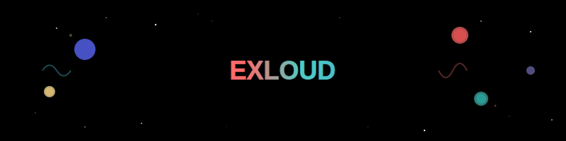

<div align="center">

</div>

---

<div align="center">

### 👀 Profile Views


**Thanks for visiting my profile! Have a great day! 😊**

</div>

---

## 📊 GitHub Stats
<div align="center">
  


</div>

---

## 🏆 GitHub Trophies
<div align="center">
  

</div>

---

## 📈 Activity Graph
<div align="center">
  

</div>

---

## 🎯 Current Focus
```javascript
const currentFocus = {
    dep: ["1"],
    dodep: ["10"],
    ultramegalastdep: ["100"],
};
console.log("-1000");
```

---
